<div align="center">

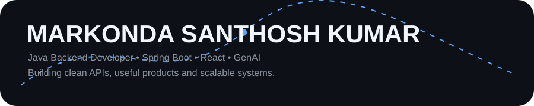

### 🚀 Java Backend Developer · Spring Boot · React · GenAI

<p>
  <a href="https://www.linkedin.com/in/santhosh-markonda/">LinkedIn</a> ·
  <a href="https://github.com/Santhoshmarkonda">GitHub</a> ·
  <a href="https://leetcode.com/u/santhosh_2305/">LeetCode</a> ·
  <a href="mailto:santhoshmarkonda786@gmail.com">Email</a>
</p>


</div>

---

## 👨‍💻 About Me

```yaml
name: Markonda Santhosh Kumar
role: Java Backend Developer
education: B.Tech CSE — AI & Data Science
location: Hyderabad, India

focus:
  - Java
  - Spring Boot
  - REST APIs
  - React
  - SQL

currently_learning:
  - Spring AI
  - Generative AI
  - AWS
  - Docker

mindset: "Clean code. Scalable systems. Real impact."
```

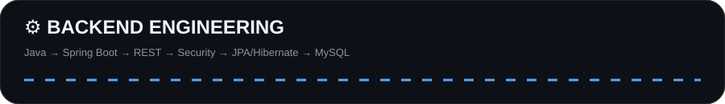

---

# 🧠 TECH STACK

> Every skill below is a custom SVG card. Hover the card to trigger its built-in 3D icon rotation.

<div align="center">

### ☕ Backend & Languages

<a href="#">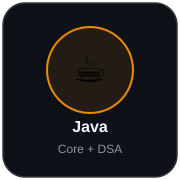</a>
<a href="#">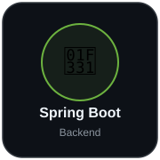</a>
<a href="#">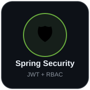</a>
<a href="#">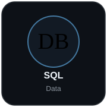</a>

<br/>

### ⚛️ Frontend

<a href="#">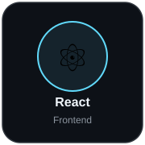</a>
<a href="#">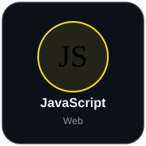</a>
<a href="#">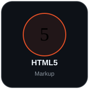</a>
<a href="#">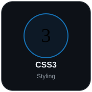</a>

<br/>

### 🗄️ Data & Persistence

<a href="#">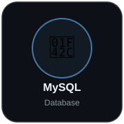</a>
<a href="#">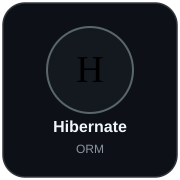</a>

<br/>

### 🛠️ Developer Tools

<a href="#">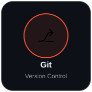</a>
<a href="#">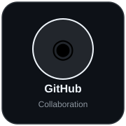</a>
<a href="#">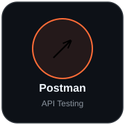</a>
<a href="#">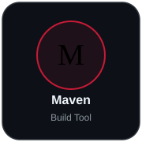</a>

<br/>

### ☁️ Cloud & AI

<a href="#">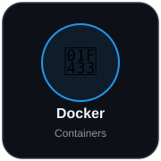</a>
<a href="#">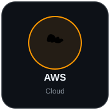</a>
<a href="#">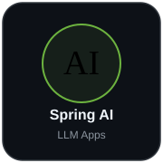</a>
<a href="#">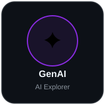</a>

</div>

---

# 🚀 PROJECTS

<div align="center">

<a href="https://github.com/Santhoshmarkonda/RiseUpp-Application">
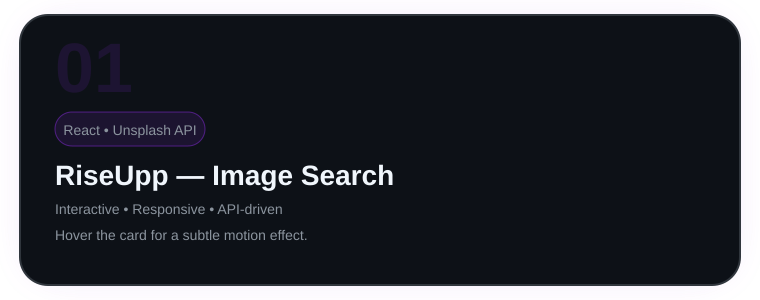
</a>

**RiseUpp — Image Search Application**

React application powered by the Unsplash API with category search, loading states, responsive layout and interactive image details.

`React` `JavaScript` `REST API` `Unsplash` `Vercel`

<a href="https://rise-upp-application.vercel.app/">🔗 Live Demo</a> ·
<a href="https://github.com/Santhoshmarkonda/RiseUpp-Application">💻 Source Code</a>

<br/><br/>

<a href="https://github.com/Santhoshmarkonda/Product-availability-Project">
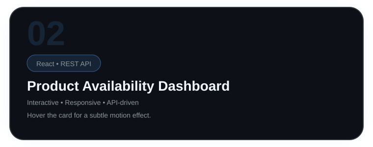
</a>

**Product Availability Dashboard**

Responsive React product interface with API fetching, searching, sorting and component-based product cards. Delete behavior is implemented as practice for cart-style item removal.

`React` `REST API` `JavaScript` `CSS`

<a href="https://github.com/Santhoshmarkonda/Product-availability-Project">💻 Source Code</a>

<br/><br/>

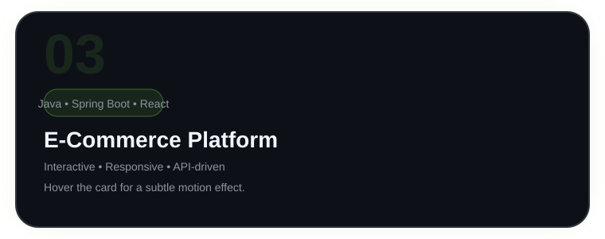

**E-Commerce Platform — In Development**

Full-stack application planned around Java, Spring Boot, Spring Security, React and MySQL with JWT authentication, RBAC, product catalog, cart, orders and layered REST architecture.

`Java` `Spring Boot` `Spring Security` `React` `MySQL` `JWT`

`🚧 Repository coming soon`

</div>

---

# 🧩 DSA & PROBLEM SOLVING

<div align="center">


### 200+ Problems Solved on LeetCode

**Current pattern:** Sliding Window  
**Revision pattern:** Two Pointers  
**Daily system:** Daily Challenge + Current Pattern + Previous Pattern

</div>

---

# 📊 GITHUB ACTIVITY

<div align="center">


<br/>


<br/>


</div>

---

# 🐍 CONTRIBUTION FLOW

<div align="center">


</div>

---

# 🎯 CURRENT FOCUS

<div align="center">

| 🔥 Area | 🎯 Goal |
|---|---|
| Java | Strong backend fundamentals + DSA |
| Spring Boot | Production-grade REST APIs |
| Security | JWT + Role-Based Authorization |
| React | Assessment-ready frontend skills |
| GenAI | Spring AI + practical AI applications |
| Cloud | AWS + Docker fundamentals |

</div>

---

# 💭 DEVELOPER LOOP

```java
while (!success) {
    learn();
    build();
    debug();
    improve();
    repeat();
}
```

> **“Code is like humor. When you have to explain it, it's bad.”**  
> — Cory House

---

# 🤝 LET'S CONNECT

<div align="center">

If you're building something interesting, hiring Java/backend talent, or want to collaborate — let's talk.

<a href="https://www.linkedin.com/in/santhosh-markonda/">

</a>
<a href="https://github.com/Santhoshmarkonda">

</a>
<a href="https://leetcode.com/u/santhosh_2305/">

</a>
<a href="mailto:santhoshmarkonda786@gmail.com">

</a>

<br/><br/>

### ⭐ If you like the work, star a repository.

</div>

---

<div align="center">

**Java → APIs → Systems → Products → AI**


</div>
